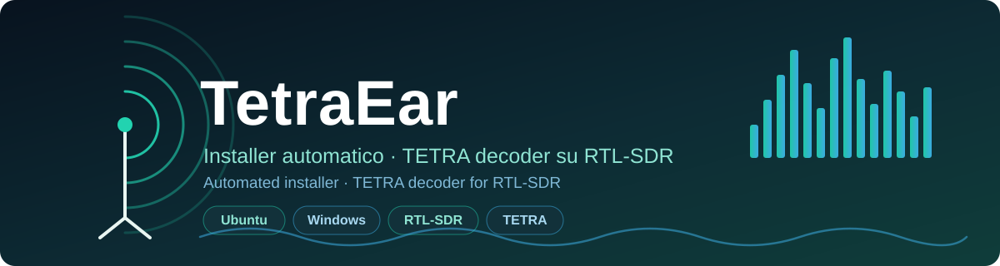

# TetraEar

<p align="center">
  
</p>

<p align="center">
  <b>Installer automatizzati per <a href="https://github.com/syrex1013/TetraEar">TetraEar</a> — decoder TETRA per chiavette RTL-SDR — su Ubuntu/Debian e Windows.</b>
</p>

[English](#english) | [Italiano](#italiano)

---

<a name="english"></a>
## 🇬🇧 English

### Overview

**TetraEar** is a TETRA (Terrestrial Trunked Radio) decoder for RTL-SDR
dongles (RTL2832U chip). This repository provides **fully automated
installers** that, from a single command, set up everything TetraEar needs:
system packages, the Python environment, the ETSI voice codec, and the
RTL-SDR configuration.

You don't need to clone TetraEar yourself — the installer downloads its
source code automatically.

> ⚠️ **Read the [legal disclaimer](DISCLAIMER.md) before using this
> software.** TetraEar is for educational and research purposes only, and
> only where permitted by the laws of your jurisdiction.

### What the installers do

1. Check Python and the operating system.
2. Install system dependencies (compiler, RTL-SDR libraries, Qt, audio).
3. Download the TetraEar source code.
4. Create a Python virtual environment (`.venv`) and install the `pip` packages.
5. Configure the RTL-SDR dongle (on Linux, automatically).
6. Download and compile the ETSI TETRA voice codec.
7. Verify that everything is in place.

Everything that happens is recorded in **`install.log`**, next to the
installer — attach that file if you ever need support.

### Requirements

- An internet connection.
- An **RTL-SDR** dongle (RTL2832U chip) with an antenna — needed only when
  you *use* TetraEar, not to install it.
- Administrator rights (Linux asks for your `sudo` password; on Windows the
  window elevates itself).

---

### 🐧 Ubuntu / Debian

Tested on **Ubuntu 24.04** and **Debian 12** (should also work on recent
derivatives such as Linux Mint and Pop!_OS).

**1. Install**

```bash
git clone https://github.com/chiaraberti13/TetraEarUbuntu.git
cd TetraEarUbuntu
python3 install_linux.py
```

You'll be asked for your `sudo` password (to install system packages). The
process takes a few minutes. When it finishes, the installer will have
created a `TetraEar/` folder next to itself, containing the source code, the
`.venv` environment and the compiled codec.

**2. The RTL-SDR dongle is configured automatically**

On Linux nothing is done by hand: the installer blacklists the DVB-T kernel
drivers that would otherwise grab the dongle, installs/reloads the udev
rules, and adds your user to the `plugdev` group.

> ⚠️ **Required final step:** after installation, **unplug and re-plug** the
> dongle (or reboot) so the driver blacklist and udev rules take effect.
> Then check it with:
>
> ```bash
> rtl_test -t
> ```
>
> If it shows "Found 1 device(s)" you're good. `usb_claim_interface error -6`
> means the DVB-T driver is still loaded → re-plug or reboot.

**3. Run TetraEar**

```bash
cd TetraEar
source .venv/bin/activate
python -m tetraear -f 392.225          # GUI
# or, headless:
python -m tetraear --no-gui -f 392.225 --auto-start
```

(replace `392.225` with the frequency in MHz you want).

**Without a terminal:** the installer also creates a **TetraEar** entry in
your applications menu and a **`TetraEar.desktop`** icon on the Desktop —
double-click to launch, no terminal needed. The icon starts capture
automatically with verbose logging, so it writes the same
`TetraEar/logs/` files (plus a `console_*.log`) as the command line — handy
if voice doesn't decode and you need to send the logs.

**Restart the app (after logout or reboot)** — just three lines:

```bash
cd ~/TetraEarUbuntu/TetraEar
source .venv/bin/activate
python -m tetraear -f 392.225
```

To launch it with a single word, create an alias once:

```bash
echo "alias tetraear='cd ~/TetraEarUbuntu/TetraEar && source .venv/bin/activate && python -m tetraear -f 392.225'" >> ~/.bashrc && source ~/.bashrc
```

Then just type `tetraear`. There is also a helper script — from the
`TetraEarUbuntu` folder run `./avvia_tetraear.sh 392.225`.

**Voice decoding & logs.** On every run the app writes detailed logs to
`TetraEar/logs/`: `codec_<id>.log`, `decoder_<id>.log`, `audio_<id>.log`,
`tetraear_<id>.log`. Run with `-v --auto-start` (add `-m` to hear the
audio) to exercise decoding, then send those files if voice doesn't come
through — the `avvia_tetraear.sh` script does exactly this.

> ℹ️ **Why voice may not decode.** Most professional TETRA networks
> **encrypt** their voice (TEA1–4): encrypted calls cannot be decoded
> without the keys and appear as 🔐 in the frames table. You also need to
> be tuned to a frequency carrying an actual **unencrypted** voice call,
> with enough gain/signal. If the frames arrive but audio is silent, check
> `codec_<id>.log` — a working codec logs `cdecoder exited 0` / `sdecoder
> exited 0`.
>
> **Status says "Signal Detected (Decoding…)" but the frames table is
> empty?** It's usually the table filters: set **Filter** to **All** and
> **uncheck "Decrypted/Text Only"** — otherwise only already-decrypted
> audio/text rows are shown. If frames then appear all marked 🔐, the
> traffic is encrypted and the lock counter (e.g. `0/0` = no keys loaded)
> confirms you have no keys, so voice can't be recovered. Also note a
> continuous carrier is often a **control channel** (signalling): voice
> only appears during an actual call.

**4. Useful commands**

| Command | What it does |
| --- | --- |
| `python3 install_linux.py` | Full installation |
| `python3 install_linux.py --repair` | Recompile only the voice codec + re-apply fixes |
| `python3 install_linux.py --uninstall` | Remove `.venv` and the codec (keeps the source) |

**5. Troubleshooting (Linux)**

- **`Could not get lock /var/lib/dpkg/lock-frontend` (held by
  `unattended-upgr`)**: Ubuntu's automatic updates run right after boot and
  hold the package lock. The installer now waits for it automatically; if it
  ever gives up, wait 2–3 minutes for the updates to finish and re-run
  `python3 install_linux.py`.
- **GUI won't start, "could not load the Qt platform plugin xcb"**: the
  installer already installs the required Qt libraries; make sure you are in
  a graphical session (not headless SSH).
- **Dongle not detected / `usb_claim_interface error -6`**: the DVB-T driver
  is still loaded. Unplug/re-plug the dongle (or reboot), then `rtl_test -t`.
- **`rtl_test` works only with sudo**: log out and back in once (to activate
  the `plugdev` group membership).
- **On start: `undefined symbol: rtlsdr_set_dithering` (or similar)**: an
  incompatibility between `pyrtlsdr` and Ubuntu's `librtlsdr` (which lacks
  some functions found only in the *keenerd* fork). The installer patches
  `pyrtlsdr` to tolerate the missing symbols; if you updated the script,
  re-run `python3 install_linux.py` (or `--repair`). This is **not** related
  to whether a dongle is connected — it happens at import time.
- **ETSI codec download fails**: try again later (the ETSI site is sometimes
  unreachable), then `python3 install_linux.py --repair`.
- **Nothing decodes, `decoder.log`/`app.log` full of `Decode error:
  'CaptureThread' object has no attribute 'signal_processor'`**: a bug in the
  upstream TetraEar source (a wrong attribute name in the capture thread).
  The installer patches it automatically; if you updated the script, re-run
  `python3 install_linux.py` (or `--repair`).

---

### 🪟 Windows

Tested on **Windows 10** and **Windows 11** (64-bit).

**1. Get the installers**

With **Git for Windows** the simplest way is to clone the repository
(Command Prompt or PowerShell):

```bat
git clone https://github.com/chiaraberti13/TetraEarUbuntu.git
cd TetraEarUbuntu
```

Without Git: open
<https://github.com/chiaraberti13/TetraEarUbuntu>, click **Code → Download
ZIP**, extract it and open the folder. Either way you need
`install_windows.bat` and `install_windows.py` in the same folder.

**2. Install**

**Double-click `install_windows.bat`.**

- Windows asks to **allow changes** (administrator rights): accept.
- If Python isn't installed, the installer installs it via `winget`. When it
  tells you to, **close the window and double-click `install_windows.bat`
  again** — the second run finds Python in the PATH and continues.
- The `.bat` then runs `install_windows.py`, which installs **Git** and
  **MSYS2** (the C compiler needed for the codec), downloads TetraEar,
  creates the environment, installs the Python packages and compiles the
  codec.

**3. RTL-SDR on Windows (a one-time step)**

`rtlsdr.dll` (plus `libusb`) is **installed automatically** by the installer —
you no longer need to download it by hand. Only the driver is manual, **once**:

- **WinUSB driver with Zadig** — download [Zadig](https://zadig.akeo.ie/),
  plug in the dongle, then *Options → List All Devices*, select
  **"Bulk-In, Interface (Interface 0)"** (or "RTL2832U"), choose the
  **WinUSB** driver and press *Replace Driver*.

**4. Run TetraEar**

**Without a terminal:** double-click **`Avvia TetraEar.vbs`** — the installer
creates it inside the `TetraEar` folder and copies it to your **Desktop**. It
launches the app with no console window.

Or from the **Command Prompt**, in the `TetraEar` folder created by the
installer:

```bat
cd TetraEar
.venv\Scripts\activate
python -m tetraear -f 392.225
```

**5. Useful commands**

| Command | What it does |
| --- | --- |
| double-click `install_windows.bat` | Full installation |
| `python install_windows.py --repair` | Recompile only the voice codec + re-apply fixes |
| `python install_windows.py --uninstall` | Remove `.venv` and the codec (keeps the source) |

**6. Troubleshooting (Windows)**

- **"winget not available"**: update *App Installer* from the Microsoft
  Store, or install Python, Git and MSYS2 by hand and re-run
  `install_windows.py`.
- **MSYS2 installed but not found**: reboot and re-run the installer.
- **Codec won't compile**: run `python install_windows.py --repair`; if it
  persists, check `install.log`.
- **On start: `undefined symbol: rtlsdr_set_dithering`**: same fix as Linux —
  the installer patches `pyrtlsdr`. Re-run the installer (or `--repair`).
- **Nothing decodes, logs full of `'CaptureThread' object has no attribute
  'signal_processor'`**: same upstream bug as Linux — the installer patches
  the TetraEar source automatically. Re-run the installer (or `--repair`).

---

### If something goes wrong (both systems)

1. Open (or attach) **`install.log`**, created next to the installer — it
   contains the full history and error details, including tracebacks of
   unexpected errors. **This is the file to send when asking for help.**
2. Use `--repair` if the problem is only the codec or the RTL-SDR
   compatibility.
3. To start over, use `--uninstall` and then reinstall.

---

<a name="italiano"></a>
## 🇮🇹 Italiano

### Panoramica

**TetraEar** è un decoder TETRA (Terrestrial Trunked Radio) per chiavette
RTL-SDR (chip RTL2832U). Questa repository contiene degli **installer
completamente automatizzati** che, con un solo comando, preparano tutto ciò
che serve a TetraEar: pacchetti di sistema, ambiente Python, codec vocale
ETSI e configurazione della chiavetta RTL-SDR.

Non devi clonare tu TetraEar: l'installer ne scarica il codice sorgente
automaticamente.

> ⚠️ **Leggi il [disclaimer legale](DISCLAIMER.md) prima di usare questo
> software.** TetraEar è destinato solo a scopi didattici e di ricerca, e
> solo dove consentito dalle leggi della tua giurisdizione.

### Cosa fanno gli installer

1. Controllano Python e il sistema operativo.
2. Installano le dipendenze di sistema (compilatore, librerie RTL-SDR, Qt, audio).
3. Scaricano il codice sorgente di TetraEar.
4. Creano un ambiente virtuale Python (`.venv`) e installano i pacchetti `pip`.
5. Configurano la chiavetta RTL-SDR (su Linux in automatico).
6. Scaricano e compilano il codec vocale ETSI TETRA.
7. Verificano che tutto sia a posto.

Tutto ciò che accade viene registrato in **`install.log`**, accanto
all'installer — allega quel file se hai bisogno di supporto.

### Cosa ti serve

- Una connessione a Internet.
- Una chiavetta **RTL-SDR** (chip RTL2832U) con antenna — serve solo quando
  *usi* TetraEar, non per installarlo.
- I permessi di amministratore (su Linux la password `sudo`; su Windows la
  finestra si eleva da sola).

---

### 🐧 Ubuntu / Debian

Testato su **Ubuntu 24.04** e **Debian 12** (dovrebbe funzionare anche su
derivate recenti come Linux Mint e Pop!_OS).

**1. Installazione**

```bash
git clone https://github.com/chiaraberti13/TetraEarUbuntu.git
cd TetraEarUbuntu
python3 install_linux.py
```

Ti verrà chiesta la password di `sudo` (per installare i pacchetti di
sistema). Il processo richiede qualche minuto. Al termine l'installer avrà
creato accanto a sé una cartella `TetraEar/` con il codice sorgente,
l'ambiente `.venv` e il codec compilato.

**2. La chiavetta RTL-SDR è configurata in automatico**

Su Linux non devi fare nulla a mano: l'installer mette in blacklist i driver
DVB-T del kernel che altrimenti "occupano" la chiavetta, installa/ricarica le
regole udev e aggiunge il tuo utente al gruppo `plugdev`.

> ⚠️ **Passaggio finale obbligatorio:** dopo l'installazione **scollega e
> ricollega** la chiavetta (oppure riavvia), così la blacklist del driver e
> le regole udev hanno effetto. Poi verifica con:
>
> ```bash
> rtl_test -t
> ```
>
> Se compare "Found 1 device(s)" sei a posto. `usb_claim_interface error -6`
> significa che il driver DVB-T è ancora caricato → ricollega o riavvia.

**3. Avvia TetraEar**

```bash
cd TetraEar
source .venv/bin/activate
python -m tetraear -f 392.225          # interfaccia grafica
# oppure senza GUI:
python -m tetraear --no-gui -f 392.225 --auto-start
```

(sostituisci `392.225` con la frequenza in MHz che ti interessa).

**Senza terminale:** l'installer crea anche una voce **TetraEar** nel menu
applicazioni e un'icona **`TetraEar.desktop`** sul Desktop — doppio clic per
avviare, senza terminale. L'icona avvia già la cattura in automatico con log
dettagliato, quindi scrive gli stessi file in `TetraEar/logs/` (più un
`console_*.log`) del comando da terminale — comodo se la voce non si
decodifica e devi inviare i log.

**Riavviare l'app (dopo logout o riavvio)** — bastano tre righe:

```bash
cd ~/TetraEarUbuntu/TetraEar
source .venv/bin/activate
python -m tetraear -f 392.225
```

Per avviarla con una sola parola, crea un alias una volta sola:

```bash
echo "alias tetraear='cd ~/TetraEarUbuntu/TetraEar && source .venv/bin/activate && python -m tetraear -f 392.225'" >> ~/.bashrc && source ~/.bashrc
```

Da allora basta digitare `tetraear`. C'è anche uno script pronto: dalla
cartella `TetraEarUbuntu` esegui `./avvia_tetraear.sh 392.225`.

**Decodifica vocale e log.** A ogni avvio l'app scrive log dettagliati in
`TetraEar/logs/`: `codec_<id>.log`, `decoder_<id>.log`, `audio_<id>.log`,
`tetraear_<id>.log`. Avvia con `-v --auto-start` (aggiungi `-m` per sentire
l'audio) per esercitare la decodifica, poi inviami quei file se la voce non
esce — lo script `avvia_tetraear.sh` fa esattamente questo.

> ℹ️ **Perché la voce può non decodificarsi.** Nelle reti TETRA
> professionali la voce è quasi sempre **cifrata** (TEA1–4): le chiamate
> cifrate non sono decodificabili senza le chiavi e compaiono come 🔐 nella
> tabella dei frame. Inoltre devi essere sintonizzato su una frequenza con
> una chiamata vocale **in chiaro** realmente attiva, con guadagno/segnale
> sufficienti. Se i frame arrivano ma l'audio è muto, guarda
> `codec_<id>.log`: un codec funzionante scrive `cdecoder exited 0` /
> `sdecoder exited 0`.
>
> **Lo stato dice "Signal Detected (Decoding…)" ma la tabella dei frame è
> vuota?** Di solito sono i filtri: imposta **Filter** su **All/Tutti** e
> **deseleziona "Decrypted/Text Only"** — altrimenti vedi solo le righe
> audio/testo già decifrate. Se poi i frame compaiono tutti con 🔐 il
> traffico è cifrato e il contatore del lucchetto (es. `0/0` = nessuna
> chiave caricata) conferma che non hai chiavi, quindi la voce non è
> recuperabile. Ricorda inoltre che un portante continuo è spesso un
> **canale di controllo** (segnalazione): la voce compare solo durante una
> chiamata reale.

**4. Comandi utili**

| Comando | Cosa fa |
| --- | --- |
| `python3 install_linux.py` | Installazione completa |
| `python3 install_linux.py --repair` | Ricompila solo il codec vocale + riapplica le correzioni |
| `python3 install_linux.py --uninstall` | Rimuove `.venv` e il codec (lascia il sorgente) |

**5. Problemi comuni (Linux)**

- **`Could not get lock /var/lib/dpkg/lock-frontend` (occupato da
  `unattended-upgr`)**: gli aggiornamenti automatici di Ubuntu partono subito
  dopo l'avvio e tengono occupato il lock dei pacchetti. L'installer ora
  attende in automatico; se dovesse arrendersi, aspetta 2-3 minuti che gli
  aggiornamenti finiscano e rilancia `python3 install_linux.py`.
- **La GUI non parte, "could not load the Qt platform plugin xcb"**:
  l'installer installa già le librerie Qt necessarie; assicurati di essere in
  una sessione grafica (non SSH senza display).
- **Chiavetta non rilevata / `usb_claim_interface error -6`**: il driver
  DVB-T è ancora caricato. Scollega/ricollega la chiavetta (o riavvia), poi
  `rtl_test -t`.
- **`rtl_test` funziona solo con sudo**: fai logout/login una volta (per
  attivare l'appartenenza al gruppo `plugdev`).
- **All'avvio: `undefined symbol: rtlsdr_set_dithering` (o simile)**: è
  un'incompatibilità tra `pyrtlsdr` e la `librtlsdr` di Ubuntu (che non ha
  alcune funzioni presenti solo nel fork *keenerd*). L'installer applica una
  patch a `pyrtlsdr` che tollera i simboli mancanti; se hai aggiornato lo
  script, rilancia `python3 install_linux.py` (o `--repair`). **Non dipende**
  dalla chiavetta: l'errore compare all'`import`.
- **Il download del codec da ETSI fallisce**: riprova più tardi (a volte il
  sito ETSI è irraggiungibile), poi `python3 install_linux.py --repair`.
- **Non decodifica nulla, `decoder.log`/`app.log` pieni di `Decode error:
  'CaptureThread' object has no attribute 'signal_processor'`**: è un bug del
  sorgente TetraEar a monte (nome di attributo errato nel thread di cattura).
  L'installer lo corregge in automatico; se hai aggiornato lo script, rilancia
  `python3 install_linux.py` (o `--repair`).

---

### 🪟 Windows

Testato su **Windows 10** e **Windows 11** (64 bit).

**1. Scarica gli installer**

Con **Git per Windows** la via più semplice è clonare la repository (Prompt
dei comandi o PowerShell):

```bat
git clone https://github.com/chiaraberti13/TetraEarUbuntu.git
cd TetraEarUbuntu
```

Senza Git: apri <https://github.com/chiaraberti13/TetraEarUbuntu>, premi
**Code → Download ZIP**, estrai e apri la cartella. In entrambi i casi ti
servono `install_windows.bat` e `install_windows.py` nella stessa cartella.

**2. Installazione**

**Fai doppio clic su `install_windows.bat`.**

- Windows chiederà di **consentire le modifiche** (permessi di
  amministratore): accetta.
- Se Python non è installato, l'installer lo installa tramite `winget`.
  Quando te lo chiede, **chiudi la finestra e rifai doppio clic** su
  `install_windows.bat`: alla seconda esecuzione trova Python nel PATH e
  prosegue.
- Il `.bat` avvia poi `install_windows.py`, che installa **Git** e **MSYS2**
  (il compilatore C per il codec), scarica TetraEar, crea l'ambiente,
  installa i pacchetti Python e compila il codec.

**3. RTL-SDR su Windows (un passaggio, una volta sola)**

`rtlsdr.dll` (con `libusb`) viene **installata automaticamente** dall'installer:
non devi più scaricarla a mano. Resta manuale solo il driver, **una volta sola**:

- **Driver WinUSB con Zadig** — scarica [Zadig](https://zadig.akeo.ie/),
  collega la chiavetta, poi *Options → List All Devices*, seleziona
  **"Bulk-In, Interface (Interface 0)"** (o "RTL2832U"), scegli il driver
  **WinUSB** e premi *Replace Driver*.

**4. Avvia TetraEar**

**Senza terminale:** fai doppio clic su **`Avvia TetraEar.vbs`** — l'installer
lo crea nella cartella `TetraEar` e ne mette una copia sul **Desktop**. Avvia
l'app senza finestra del terminale.

Oppure dal **Prompt dei comandi**, nella cartella `TetraEar` creata
dall'installer:

```bat
cd TetraEar
.venv\Scripts\activate
python -m tetraear -f 392.225
```

**5. Comandi utili**

| Comando | Cosa fa |
| --- | --- |
| doppio clic su `install_windows.bat` | Installazione completa |
| `python install_windows.py --repair` | Ricompila solo il codec vocale + riapplica le correzioni |
| `python install_windows.py --uninstall` | Rimuove `.venv` e il codec (lascia il sorgente) |

**6. Problemi comuni (Windows)**

- **"winget non disponibile"**: aggiorna *Programma di installazione app* dal
  Microsoft Store, oppure installa Python, Git e MSYS2 a mano e rilancia
  `install_windows.py`.
- **MSYS2 installato ma non trovato**: riavvia e rilancia l'installer.
- **Il codec non compila**: esegui `python install_windows.py --repair`; se
  persiste, controlla `install.log`.
- **All'avvio: `undefined symbol: rtlsdr_set_dithering`**: stessa soluzione di
  Linux — l'installer applica la patch a `pyrtlsdr`. Rilancia l'installer (o
  `--repair`).
- **Non decodifica nulla, log pieni di `'CaptureThread' object has no attribute
  'signal_processor'`**: stesso bug a monte di Linux — l'installer corregge in
  automatico il sorgente di TetraEar. Rilancia l'installer (o `--repair`).

---

### In caso di problemi (entrambi i sistemi)

1. Apri (o allega) **`install.log`**, creato accanto all'installer: contiene
   la cronologia completa e i dettagli degli errori, compresi i traceback
   degli errori imprevisti. **È il file da inviare per chiedere supporto.**
2. Usa `--repair` se il problema riguarda solo il codec o la compatibilità
   RTL-SDR.
3. Per ripartire da zero, usa `--uninstall` e poi reinstalla.

---

<p align="center">
  <sub>Usa TetraEar solo nel rispetto delle leggi vigenti · Use TetraEar only in compliance with applicable laws — <a href="DISCLAIMER.md">DISCLAIMER</a></sub>
</p>
